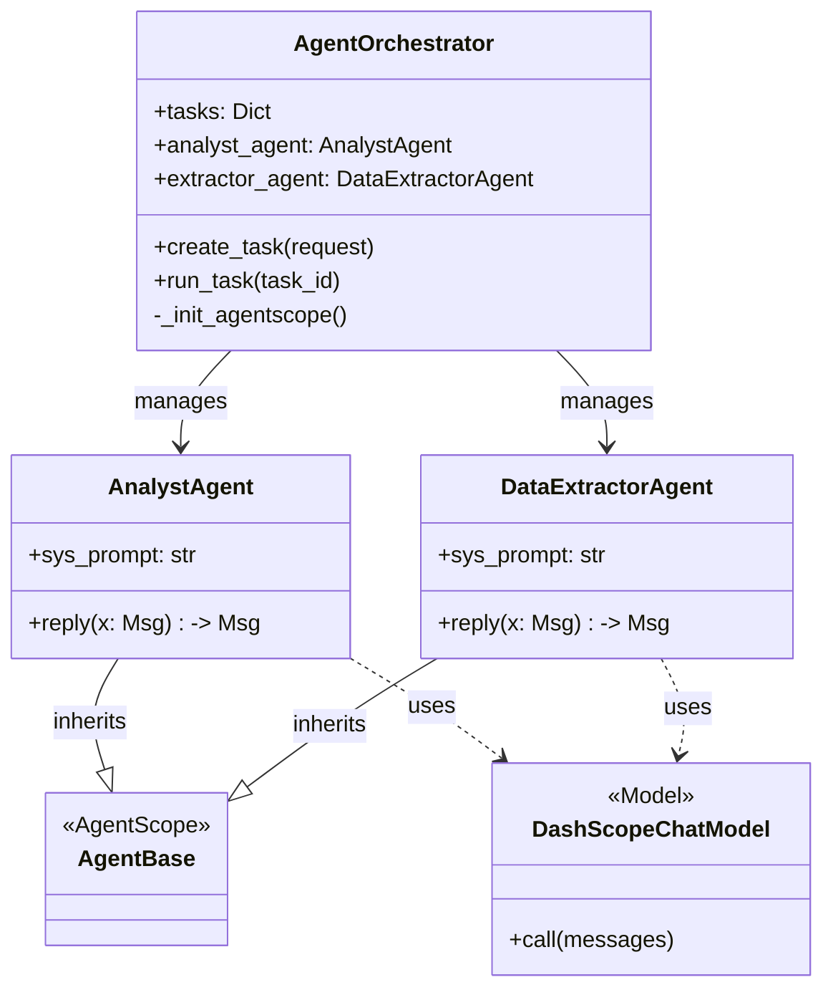
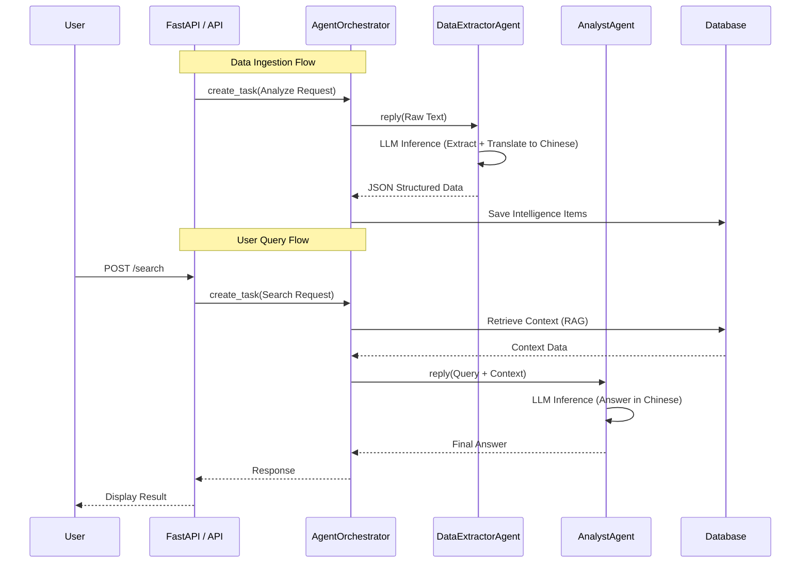

# System Architecture Documentation

## 1. Agent Architecture (AgentScope)

The intelligence system utilizes a multi-agent architecture powered by **AgentScope**. This design decouples task management from specific agent capabilities, allowing for scalable and modular development.

### Class Diagram

### Execution Flow (Sequence Diagram)

## 2. Backend Architecture

The backend is built with **FastAPI** and **SQLAlchemy**, following a layered architecture.

### Directory Structure
- **`app/main.py`**: Application entry point, configures CORS and routes.
- **`app/routes/`**: API route definitions (e.g., `intel.py`).
- **`app/agent/`**: Agent logic and orchestration (AgentScope integration).
- **`app/crud.py`**: Database interactions (Create, Read, Update, Delete).
- **`app/models.py`**: Pydantic models for data validation and API schemas.
- **`app/db_models.py`**: SQLAlchemy ORM models mapping to database tables.
- **`app/database.py`**: Database connection and session management.

### Key Components

1.  **Orchestrator Pattern**: `AgentOrchestrator` serves as the central hub. It initializes AgentScope agents (`AnalystAgent`, `DataExtractorAgent`) and manages the lifecycle of asynchronous tasks.
2.  **Asynchronous Execution**: Long-running agent tasks are handled asynchronously using `asyncio` to prevent blocking the main API thread.
3.  **Dependency Injection**: Database sessions (`SessionLocal`) are injected into route handlers, ensuring proper connection management.

## 3. Database Schema

The database uses **SQLite** (for MVP) with **SQLAlchemy ORM**.

### `intel_items` Table

| Column | Type | Description |
| :--- | :--- | :--- |
| `id` | String (PK) | UUID, unique identifier for the item. |
| `title` | String | Title of the intelligence event (Chinese). |
| `summary` | Text | Detailed summary or value point (Chinese). |
| `source` | String | Source of the information (e.g., "Reuters"). |
| `url` | String | **(New)** Original URL of the source. |
| `publish_time_str` | String | Original publication time string. |
| `timestamp` | Float | Unix timestamp for sorting. |
| `tags` | JSON | List of tags (e.g., ["Politics", "Economy"]). |
| `is_hot` | Boolean | Flag indicating if the item is a hot topic. |
| `favorited` | Boolean | **(New)** User favorite status. |

---
**Note**: All intelligence content (Title, Summary, Tags) is mandated to be in **Chinese** via the `DataExtractorAgent` system prompt, regardless of the input language.
