# System Architecture Documentation

## 1. Overview

This repository is an MVP for an AI-assisted intelligence workflow:

- **Backend**: FastAPI + SQLAlchemy (SQLite), AgentScope-powered agents, SSE streaming.
- **Frontend**: React + Vite + TypeScript, virtualized list, tab-based intel workflow.

The system has two primary user-facing flows:

1. **Real-time Hot Stream** (SSE global stream): new items are broadcast to clients.
2. **History / Search**: items are read from DB and agent-assisted search streams results.

## 2. Agent Architecture (AgentScope)

The backend uses an orchestrator to manage three agent roles:

- **AnalystAgent**: answers user queries with retrieved context.
- **DataExtractorAgent**: extracts structured intel from raw text batches (`raw_data`).
- **RefinementAgent**: cleans/translates/tags intel dicts (used by orchestrator; currently not enabled in the live CMS poller path).

### Class Diagram

```mermaid
classDiagram
    class AgentOrchestrator {
        +tasks: Dict
        +analyst_agent: AnalystAgent
        +extractor_agent: DataExtractorAgent
        +refinement_agent: RefinementAgent
        +global_cache: Deque
        +create_task(request)
        +run_stream(task_id)
        +run_global_stream()
        +broadcast(event, data)
        +get_cached_intel(id)
        +refine_intel_item(item_dict)
        +analyze_data_file()
        -_init_agentscope()
    }

    class AgentBase {
        <<AgentScope>>
    }

    class AnalystAgent {
        +reply(x: Msg) -> Msg
    }

    class DataExtractorAgent {
        +reply(x: Msg) -> Msg
    }

    class RefinementAgent {
        +reply(x: Msg) -> Msg
    }

    class DashScopeChatModel {
        <<Model>>
        +call(messages)
    }

    AgentOrchestrator --> AnalystAgent : manages
    AgentOrchestrator --> DataExtractorAgent : manages
    AgentOrchestrator --> RefinementAgent : manages
    AnalystAgent --|> AgentBase : inherits
    DataExtractorAgent --|> AgentBase : inherits
    RefinementAgent --|> AgentBase : inherits
    AnalystAgent ..> DashScopeChatModel : uses
    DataExtractorAgent ..> DashScopeChatModel : uses
    RefinementAgent ..> DashScopeChatModel : uses
```

### Execution Flows (Sequence Diagrams)

#### 2.1 User Query (Agent-assisted search)

#### 2.2 Real-time Hot Stream (SSE global stream)

#### 2.3 “Persist on Detail” (cache → DB)

## 3. Backend Architecture

### Directory Structure (key files)

- Entry: [main.py](file:///home/system_/system_mvp/backend/app/main.py)
- Routes: [routes/intel.py](file:///home/system_/system_mvp/backend/app/routes/intel.py), [routes/agent.py](file:///home/system_/system_mvp/backend/app/routes/agent.py), [routes/auth.py](file:///home/system_/system_mvp/backend/app/routes/auth.py)
- Agent orchestration: [agent/orchestrator.py](file:///home/system_/system_mvp/backend/app/agent/orchestrator.py), [agent/agents.py](file:///home/system_/system_mvp/backend/app/agent/agents.py)
- Services: [services/payload_poller.py](file:///home/system_/system_mvp/backend/app/services/payload_poller.py), [services/poller.py](file:///home/system_/system_mvp/backend/app/services/poller.py)
- Persistence: [database.py](file:///home/system_/system_mvp/backend/app/database.py), [db_models.py](file:///home/system_/system_mvp/backend/app/db_models.py), [crud.py](file:///home/system_/system_mvp/backend/app/crud.py), [models.py](file:///home/system_/system_mvp/backend/app/models.py)

### Public API Surface (current)

- Intel
  - `GET /api/intel` list with `type/q/range/limit/offset`
  - `GET /api/intel/favorites`
  - `POST /api/intel/export`
  - `GET /api/intel/{id}`
  - `POST /api/intel/{id}/favorite`
- Agent
  - `POST /api/agent/run`
  - `GET /api/agent/stream/{task_id}` (SSE)
  - `GET /api/agent/stream/global` (SSE)
- Auth
  - `POST /api/auth/register`, `POST /api/auth/login`
  - `GET/PUT /api/auth/me`, `PUT /api/auth/me/password`

## 4. Database Schema

The MVP uses SQLite with SQLAlchemy ORM.

### 4.1 `intel_items`

| Column | Type | Notes |
| :--- | :--- | :--- |
| `id` | String (PK) | UUID |
| `title` | String | Display title |
| `summary` | Text | Display summary |
| `content` | Text | Optional full content |
| `source` | String | Source label |
| `url` | String | Optional source URL |
| `publish_time_str` | String | Display time |
| `timestamp` | Float | Sorting + range filter |
| `tags` | JSON | `[{label,color}]` serialized |
| `is_hot` | Boolean | Hot vs history |
| `favorited` | Boolean | User state |
| `thing_id` | String | CMS id mapping |
| `created_at` | DateTime | DB insert time |

### 4.2 `raw_data`

`raw_data` supports offline/batch extraction via `DataExtractorAgent` (`analyze_data_file`). Items are marked `processed` after extraction.

## 5. Frontend Architecture

### Key modules

- Routing/layout: [App.tsx](file:///home/system_/system_mvp/frontend/src/App.tsx), [Layout.tsx](file:///home/system_/system_mvp/frontend/src/components/layout/Layout.tsx), [Sidebar.tsx](file:///home/system_/system_mvp/frontend/src/components/layout/Sidebar.tsx)
- Intel workflow: [IntelPage.tsx](file:///home/system_/system_mvp/frontend/src/pages/IntelPage.tsx), [IntelDetailPage.tsx](file:///home/system_/system_mvp/frontend/src/pages/IntelDetailPage.tsx)
- Data hooks:
  - [useGlobalIntel.ts](file:///home/system_/system_mvp/frontend/src/hooks/useGlobalIntel.ts) connects to global SSE stream
  - [useIntelQuery.ts](file:///home/system_/system_mvp/frontend/src/hooks/useIntelQuery.ts) runs agent tasks + streams results
- API client: [api.ts](file:///home/system_/system_mvp/frontend/src/api.ts)
